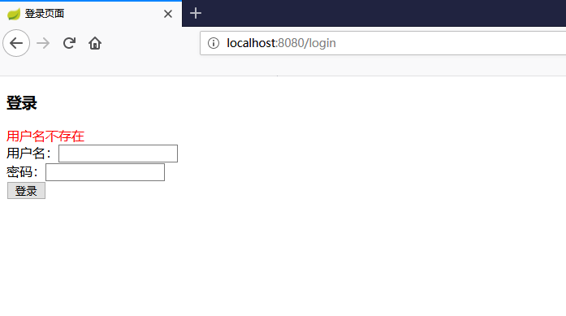
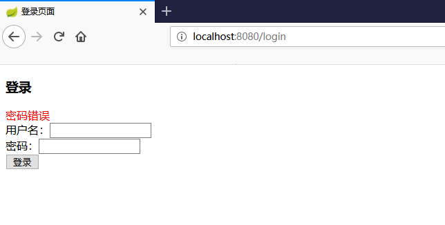
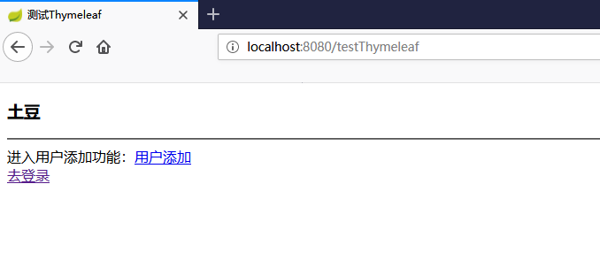

## shiro权限
|名称|版本|
|----|----|
|系统|win10|
|jdk|1.8|
|SpringBoot|2.1.7.RELEASE|
|mysql|5.6|
|druid|1.1.20|
|mybatis|2.1.0|
|shiro|1.4.0|
|thymeleaf|2.1.7.RELEASE|

## 使用
potato下的sql导入mysql  
clone本项目运行(idea)  
注意：要修改数据库的`用户名密码`  
数据库两个账号  
运行的url：http://localhost:8080/testThymeleaf  

|用户名|密码|
|----|----|
|potato|123456|
|jack|123456|
两者权限不一样

## 认证和授权
核心API  
Subject 用户主体(把操作交给SecurityManager)  
SecurityManager 安全管理器(关联Ralm)  
Realm：shiro连接数据的桥梁

## 视频学习
https://www.bilibili.com/video/av37984279

## 截图

